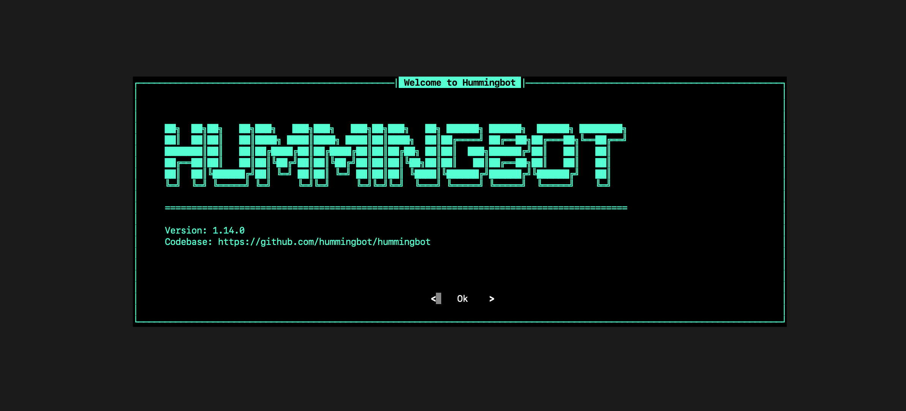

# Deploy Hummingbot Instance

This installs a single [Hummingbot](https://github.com/hummingbot/hummingbot) instance as a Docker container.

## Prerequisites

This configuration requires [Docker Compose](https://docs.docker.com/compose/), a tool for defining and running multi-container Docker applications. The recommended way to get Docker Compose is to install [Docker Desktop](https://www.docker.com/products/docker-desktop/), which includes Docker Compose along with Docker Engine and Docker CLI which are Compose prerequisites.

See [Docker](../DOCKER.md) for more information about how to install and use Docker Compose, as well as helpful commands.

## Getting Started

Verify that Docker Compose is installed correctly by checking the version:

```bash
docker compose version
```

The output should be: `Docker Compose version v2.17.2` or similar. Ensure that you are using Docker Compose V2, as V1 is deprecated.

### 1. Launch network

Clone this repo to your machine and go to the folder:
```
git clone https://github.com/hummingbot/deploy-examples.git
cd deploy-examples/simple_hummingbot_compose
```

Alternatively, copy the `docker-compose.yml` file to a directory on your machine where you want to store your Hummingbot files. 

This is the "root folder" where your encrypted keys, scripts, trades, configs, logs, and other files related to your bots will be saved.

From the root folder, run the following command to pull the image and start the instance:
```
docker compose up -d
```

After the images have been downloaded, you should see the following output:
```
[+] Running 1/1
 ⠿ Container hummingbot  Started 
 ```

### 2. Set permissions

Run this command from your root folder to grant read/write permission to the `hummingbot_files` sub-folder:
```
sudo chmod -R a+rw ./hummingbot_files
```

### 3. Populate scripts folder with example scripts
Run this command to copy the sample scripts into the `scripts` folder. Any new scripts you add here will also be available to your `hummingbot` instance.
```
docker cp hummingbot:/home/hummingbot/scripts-copy/. ./hummingbot_files/scripts/
```

### 4. Launch Hummingbot

Attach to the `hummingbot` instance:
```
docker attach hummingbot
```

You should see the Hummingbot welcome screen:




To get started with Hummingbot, check out the following docs:

* [Basic Features](https://docs.hummingbot.org/operation/)
* [Quickstart Guide](https://docs.hummingbot.org/quickstart/)
* [Hummingbot FAQ](https://docs.hummingbot.org/faq/)
